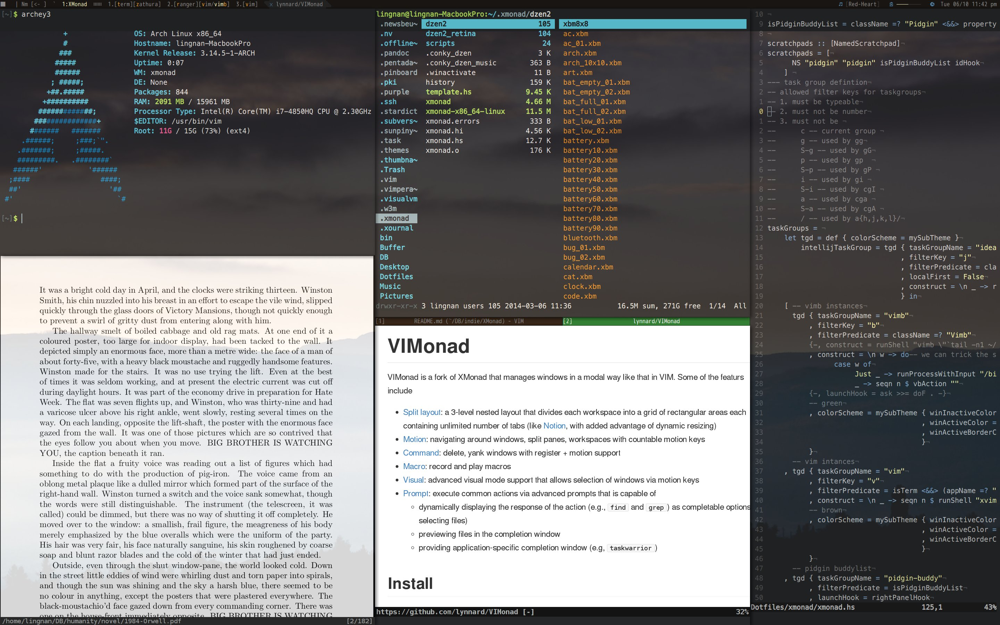
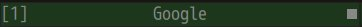
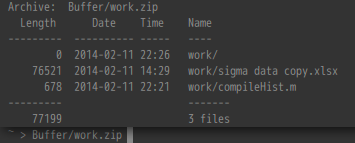
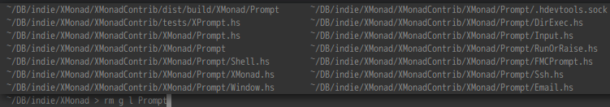
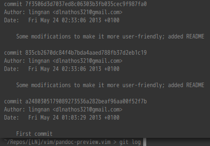
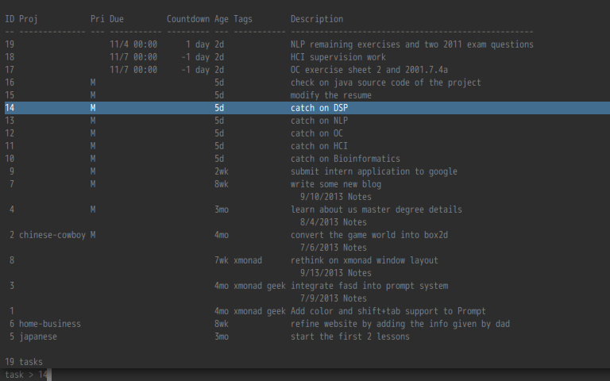

# VIMonad

VIMonad is a fork of XMonad that manages windows in a modal way like that in VIM. Some of the features include

* [Split layout](#layout): a 3-level nested layout that divides each workspace into a grid of rectangular areas each containing unlimited number of tabs (like [Notion](http://notion.sourceforge.net/), with added advantage of dynamic resizing)
* [Motion](#motion): navigating around windows, split panes, workspaces with countable motion keys
* [Command](#command): delete, yank windows with register + motion support
* [Macro](#macro): record and play macros
* [Visual](#visual): advanced visual mode support that allows selection of windows via motion keys
* [Prompt](#prompt): execute common actions via a variety of prompts that are capable of
    * dynamically displaying the response of an action (e.g., `find` and `grep`) as complete-able options (for selecting files)
    * previewing files in the completion window
    * providing application-specific completion window (e.g, `taskwarrior`)

## Acknowledgements

VIMonad is built upon XMonad and it borrows a lot of great modules already existing in its Contrib library. I'd like to thank all the people who have made XMonad a fantastic window manager in the first place.

## Install

### Dependencies

* [cabal](http://www.haskell.org/cabal/): for installing packages
* [wmctrl](http://tomas.styblo.name/wmctrl/): for activating windows from the command line
* [FMD](http://github.com/lynnard/fmd) and [FMC][FMC]: if you'd like to use the radio service in VIMonad
* [taskwarrior][task]: task management from the prompt
* [vimb][vimb]: light-weight browser with its histories and bookmarks accessible from the prompt
* [xdotool](http://www.semicomplete.com/projects/xdotool/xdotool.xhtml): for playing back text macros
* [ranger](http://nongnu.org/ranger/): for deciding the program to launch files from [Dynamic prompt](#dynamic-prompt)

### Steps

1. clone the repo somewhere
2. move all the scripts under [bin](bin) to a directory included in `$PATH`
3. copy files under [.xmonad](.xmonad) to `~/.xmonad` (note your old xmonad configuration will be overriden)
    * [.xmonad/xmonad.hs][xmonad.hs] serves as a template config file; modify it if you'd like
4. `cd` into [xmonad](xmonad); `cabal install`
5. `cd` into [XMonadContrib](XMonadContrib); `cabal install`

## Concepts

### Layout

(Zoom in to see how the layout is represented on the statusbar)

#### Hierarchy

~~~
workspace(s)
└── row(s)
    └── line(s)
        └── tab(s)
~~~

* **workspaces**: the conventional sense of workspace as used in most window managers
    * the workspace labels are the symbols before `:<name>` 
    * the system starts up with only one workspace `` ` `` (the temporary workspace)
    * new workspaces are added dynamically via [prompt](#workspace-prompt); the aim is to organize workspaces by **context** (each workspace for one task)
    * each workspace has its own *current directory*; this can be changed by `cd` in the [DynamicPrompt](#dynamic-prompt)
* **rows**: vertical columns each spanning the entire the height of the screen
    * each row has a label attached to it - the first row in the workspace gets `1`, the second gets `2`, so on and so forth; the entire *stream* of symbols used as labels can be found in the source
    * row labels are displayed in the statusbar (before each group of square brackets)
* **lines**: horizontal rectangular regions contained in *rows*, each holding an arbitrary number of tabs 
    * the lines don't have labels; however, you'll be able to reference lines using `[num]G` as in vim
* **tabs**: as the ones seen in modern browsers; each tab is a window
    * the tab labels are shown near the leftmost edge of each tab
    * each tab might have a different colorscheme according to the definition of the task group it belongs to e.g., in the image above, vim windows have a brownish tab color, whereas [vimb][vimb] windows have a green one
    * tabs are only shown for lines with more than one window (due to a bug in the tabbed layout, currently it's not possible to show tabs at all time)
* **minimized**: a special case is that windows can be minimized in each workspace
    * this happens when the window is deleted into a specified register (see [delete](#delete))
    * or the window is moved (into the unnamed or specified register) (see [move](#move))
    * the minimized windows are shown in the statusbar with `|` between them and labelled with the names of the registers they belong to

#### Resizing

* `M-<`: shrink current row
* `M->`: expand current row
* `M-\`: restore default size for the current row
* `M--`: shrink current line
* `M-+`: expand current line
* `M-=`: restore default size for the current line

### Task group

A major concept of VIMonad is task group. A task group defines a groups of windows that share the same or similar characteristics e.g., vim terminal windows, browser windows, etc.

Each task group might have a `filterKey` to be referenced in motions. This can be a single key or a sequence of keys.

Each task group also comes with a construction function that constructs a new instance of the group. 

Checkout [xmonad.hs][xmonad.hs] for how to define task groups.

Checkout [Taskgroup.hs](XMonadContrib/XMonad/Vim/TaskGroup.hs) for source about task groups.

### Register

Registers server two purposes in VIMonad:

1. they act as *marks* attached to windows, by referencing which we can cycle within a specific group of windows
2. they also act as *registers* like those in vim - we can delete, move, yank windows into registers
    * when we delete or move windows into registers, they are actually minimized as mentioned before
    * when we yank windows into registers, the windows stay in their original places

Attached registers are displayed for each window within the sqaure brackets of its tab label as `'<reg>['<another reg>]`.

### Insertion

Insertion of windows/workspaces emulate the relevant aspects from vim

* `a`: insert after the current window/workspace
* `i`: insert before the current window/workspace
* `A`: insert at the end of the line/workspaces
* `I`: insert at the beginning of the line/workspaces

#### Insertion order

When a window is inserted, you can choose to keep the focus on the old window without switching to the new window

* `M-C-x` toggles this behavior
* for some commands, an additional `g` *temporarily* toggles this behavior as well

## Keys

Some points to note: 

* to perform any key sequence mentioned below, you need to press the first character with the modMask defined by you, e.g., to trigger `g2w` (move down 2 windows), press `M-g` followed by `2` and `w`.
    * exceptions are keystrokes with a dash inside, e.g., `M1-<tab>`, for which you press the exact key combo
* `{}` means the key inside is not needed when the motion is passed as an argument to a command
* `[]` means the key inside is optional
* `<num>` can be any number from 2 to 9
* `<tab>` means any tab label in the current *line*
* `<row>` means any row label in the current workspace
* `<workspace>` means any workspace label in the current X session
* `<reg>` means a single character register; the character can be any that can be typed on the keyboard, however some of them are special
    * `/`: a special register that pops out a prompt for you to enter the exact arbitrary name for the register
    * `"`: the unnamed register used by [move](#move) and [paste](#paste)
        * as in vim, the unnamed register pushes content through registers `1` to `9`
    * `*`: always references the minimized windows that aren't present in any other register
    * `'`: always references the last visited window
    * an uppercase letter register *appends* the content to its lowercase letter register; the lowercase register *replaces* its original content (like in vim)
        * e.g., `'Adw` deletes the window and *appends* it to register `a`, whereas `'adw` deletes the window and it then *replaces* the original content in register `a`
* `<group>` means the `filterKey` of a task group in the current workspace
    * a special group is `c`, which is the task group of the *current window* 
    * so for example `gc` cycles to the next window for the current task group, `dgc` deletes all the windows in the current task group
* `<macro>` means a single- or multi- character macro register; the characters can be any that can be typed on the keyboard, except
    * `/`: a special register that pops out a prompt for you to enter the exact name for the macro

### Motion

* `f<tab>`: moves to the tab with label `<tab>`
* `<M1-<tab>>`: leaps to the given tab 
    * the difference between *leap* and `f` is that *leap* references the tab without travelling along any window
    * when used as selection *leap* only selects the given specific tab
    * when used for navigation under normal mode, *leap* allows you to leap to the last visited window/row/workspace if the argument selects the currently focused window/row/workspace
* `f<C-<row>>`: moves to the given row
* `<C-<row>>`: leaps to the given row
    * when used as selection only selects the given specific row
* `f<M-<workspace>>`: moves to the given workspace
* `M-<workspace>`: leaps to the given workspace
    * when used as selection only selects the given specific workspace
* `[{g}<num>]b`: to the `<num>`'th windows/tabs back
* `[{g}<num>]w`: to the `<num>`'th windows/tabs forward
* `{g}0`: to the beginning of the line
* `{g}$`: to the end of the line
* `{g}<C-0>`: to the first row
* `{g}<C-$>`: to the last row
* `{g}<M-0>`: to the first workspace
* `{g}<M-$>`: to the last workspace
* `gg`: go to the top line
    * when used as selection this performs line-wise selection i.e. from the current line to the first line
* `{g}G`: go to the bottom line
    * when used as selection this performs line-wise selection
* `{g}<num>G`: go to the `<num>`'th line
    * when used as selection this performs line-wise selection
* `g<group>`: cycle to the next window in `<group>`
    * when used as selection this selects all windows in that group in the current workspace
* `G<group>`: cycle to the previous window in `<group>`
* `{g}'<reg>`: cycle to the next window in the `<reg>`
    * when used as selection this selects all windows in that register
* `[{g}<num>]k`: to the `<num>`'th line up
    * when used as selection this performs line-wise selection
* `[{g}<num>]j`: to the `<num>`'th line down
    * when used as selection this performs line-wise selection
* `[{g}<num>]h`: to the `<num>`'th row back
    * when used as selection this performs row-wise selection
* `[{g}<num>]l`: to the `<num>`'th row forward
    * when used as selection this performs row-wise selection
* `[{g}<num>][`: to the `<num>`'th workspace back
    * when used as selection this performs workspace-wise selection
* `[{g}<num>]]`: to the `<num>`'th workspace forward
    * when used as selection this performs workspace-wise selection

### History jumplist

* `M-o`: move to the previous window in the jumplist
* `M-i`: move to the next window in the jumplist

### Object

Objects are used with commands, where the same command is applied to all the windows contained in the object.

* `[<num>]<command>`: apply the command to `<num>` of lines starting from the current line
    * `<command>` means the same letter as the command, e.g., `dd` deletes the current line
* `[<num>]r`: apply the command to `<num>` of rows starting from the current one
* `[<num>]s`: apply the command to `<num>` of workspaces starting from the current one

### Command

#### Delete

    ['<reg>]d<motion/object>

* if `'<reg>` is given, minimize the windows selected by the `<motion/object>` and then attach them to register `<reg>`
* else delete the windows selected by `<motion/object>`
* when `<motion/object>` is workspace-wise, always perform deletion of the workspaces (workspaces do not have register support) 
    * note: for the temporary workspace, `` ` ``, the windows inside will be deleted, but the workspace itself will always exist (to avoid the problem of erasing all workspaces)

#### Move

    ['<reg>]m<motion/object>

Same as [delete](#delete), except

* when `'<reg>` is not given, minimize the windows into `"` register
    * push windows in registers `"12345678` one step forward to `123456789` and then forgetting the windows in register `9`
    * the 'forgotten' windows are not deleted, they are just not referenced by any register anymore (except `*`)

#### Yank

    '<reg>y<motion/object>

yank the windows selected by `<motion/object>` into register `<reg>`

* workspace-wise `<motion/object>` are not supported

#### Paste

    ['<reg>][g]p

paste the windows in register `<reg>`

* if `g` is supplied, temporarily alter the current [insertion order](#insertion-order)
* if `<reg>` is not supplied, paste windows in the unnamed register `"`

#### Change

    ['<reg>]c<motion/object><group>

[delete](#delete) the windows selected by `<motion/object>` into `<reg>` and replace them by a new window constructed for group `<group>`

* here a special group is `/`, which brings up the [DynamicPrompt](#dynamic-prompt) to launch arbitrary windows

#### Construct

    ['<reg>]c[<num>][g]<insert position><group>

[delete](#delete) the [visually selected](#visual) windows into `<reg>` (only applicable within active visual mode), construct `<num>` of new window(s) for group `<group>` and insert it/them at the position specified by `<insert position>`, which can be:

* `a`: after the current window
* `i`: before the current window (the default behavior of XMonad)
* `A`: at the end of the line
* `I`: at the beginning of the line
* `C-j`: as a new line down
* `C-k`: as a new line up
* `C-h`: as a new row on the left
* `C-l`: as a new row on the right

* similar to [change](#change), a special group is `/`, which brings up the [DynamicPrompt](#dynamic-prompt) to launch arbitrary windows
* when `g` is supplied, temporarily alter the current [insertion order](#insertion-order)

#### Unregister

    u<motion/object>

remove the association between the windows selected by `<motion/object>` with any registers

### Macro

Macros are by default stored under `~/.macros`. There are two types of macros

1. a saved list of key sequences in VIMonad; these can be recorded directly in VIMonad
2. an arbitrary piece of text; when triggered it is typed into the focused window via `xdotool`, like a snippet

#### Actions

* `q<macro>`: start recording the ensuing key sequences into `<macro>`
    * when recording the statusbar will show a `●` followed by the name of the macro
* `q<Esc>`: stop recording
* `a<macro>`: play the macro stored in `<macro>`

### Visual

Similar to vim, VIMonad allows you to visually select windows. There is, however, an added subtlety about *passive/active* visual.

#### Passive visual

Passive visual is indicated by a small triangle on the right edge of the selected tab. It stays on unless `M-<Esc>` is pressed.

Passive visual is useful for chaining [commands](#visual-command) - you can for example, move the selected windows into the left adjacent row and continue moving them up/down different lines.

#### Active visual

Active visual is indicated by a small square on the right edge of the selected tab. This is more like the visual mode in vim.

You can enter the active visual mode by

* `M-v`: visually select the current window and enter window-wise selection mode
* `M-S-v`: visually select the current line and enter line-wise selection mode
* `M-C-v`: visually select the current row and enter row-wise selection mode

In the active visual mode you can perform any [motion](#motion) to toggle the selection of windows in the respective range.

To quit the active visual mode, press `M-<Esc>`; this commits the selected windows to *passive visual* (press `M-<Esc>` again to remove passive visual).

#### Visual command

These commands operate on

1. when inside active visual mode, any windows currently selected
2. or window(s) with passive visual in the current line, if any
3. or the currently focused window

* `['<reg>]x`: [delete](#delete) counterpart for selection
* `['<reg>]X`: [move](#move) counterpart for selection
* `y<reg>`: [yank](#yank) counterpart for selection
* `M-S-u`: [unregister](#unregister) counterpart for selection
* `M-S-j`: move the selected windows down a line
* `M-S-k`: move the selected windows up a line
* `M-S-h`: move the selected windows left a row
* `M-S-l`: move the selected windows right a row
* `M-C-j`: move the selected windows to a new line down
* `M-C-k`: move the selected windows to a new line up
* `M-C-h`: move the selected windows to a new row left
* `M-C-l`: move the selected windows to a new row right

### Other useful keys

* `[g<num>]W`: swap the current window `<num>` of times down the line
* `[g<num>]B`: swap the current window `<num>` of times up the line
* `[g<num>]}`: shift the current window to the workspace `<num>` of distance down
* `[g<num>]{`: shift the current window to the workspace `<num>` of distance up
* `[g<num>]<C-]>`: swap the current workspace `<num>` of times down
* `[g<num>]<C-[>`: swap the current workspace `<num>` of times up
* `<M1-S-<tab>>`: insert the current window at `<tab>`
* `<C-S-<row>>`: shift the current window to `<row>`
* `<M-S-<workspace>>`: shift the current window to `<workspace>`
* `M-<Space>`: toggle `Full` layout for the current row (maximize the focused window in the current row)
* `M-S-<Space>`: toggle `Full` layout for the current workspace (maximize the current row in the workspace)

### Prompt

#### Workspace Prompt

As mentioned before, each workspace in VIMonad is dynamically allocated, and linked to a directory when being created. This is achieved via the workspace prompt - the prompt allows you to search in a *tag database* composed of directories with their names as tags (by default under `~/DB`), and select/create the directory for initializing the workspace.

For example, say I want to create a new workspace after the current one for research on `VIMonad`, I can

1. press `M-s a` (mnemonic: *space* create *after*), and enter in the prompt `VIMonad`
2. if this *tag* already exists, I can see the directory in the completion window and choose it to have a new workspace rooted on that
3. if it doesn't, I can instead input something like `indie/VIMonad` to create a new *tag* inside `indie` and root the new workspace in that new directory
4. on the other hand I can also choose to not select any *tag* and just stick with `VIMonad` in the prompt; this gives me a new workspace rooted on home directory
5. for 2 and 3 the new workspace will have an abbreviated version of the tag name as its workspace name; for 4 it will be whatever text you've put into the prompt

The full syntax for the workspace prompt is:

    s<space action>

where `<space action>` can be

* `a`: create workspace after the current one (or switch to an existing workspace)
* `i`: create workspace before the current one (or switch to an existing workspace)
* `A`: create workspace at the end of the workspace list (or switch to an existing workspace)
* `I`: create workspace at the beginning of the workspace list (or switch to an existing workspace)
* `C`: change the name of the current directory

#### Dynamic Prompt

Dynamic prompt is an integral part of VIMonad as it handles almost all *program-related* aspects of the system. Instead of being a simple program launcher like *dmenu*, dynamic prompt is more like a full-fledged *shell* environment.

Dynamic prompt is activated via `M-r`.

You can

* execute arbitrary shell commands, with full shell completion support
    * if the program name is eliminated, it defaults to opening/launching the file using `rifle` from `ranger`
* preview files

    

* search files dynamically with *search widgets*

    

    * `l` (locate): search for files recursively in a given directory (or the current one, if not specified) using `find`
    * `t` (tag): search for a directory in the *tag database* using *find*
    * `g` (grep): list all files containing the given words
    * `h` (history): search for files launched in the past 
* enter application-specific completion environment
    * `git`

        

    * [task][task]

        

    * dictionaries (using `sdcv`)
    * calculator (using `calc`)
    * [vimb][vimb] history and bookmarks
    * [FMC] radio service for douban.fm and jing.fm
* execute shortcut commands, e.g.
    * `M-d`/`M-C-d`: cycle dictionaries forward/backwards
    * `M-h`: reboot
    * `M-b`: input `vb ` in the prompt and enter [vimb][vimb] completion environment
    * `M-k`: input `tk ` in the prompt and enter [task][task] completion environment

#### Search prompt

Search windows by register/title/workspace name in the current X session

* `M-/`: search windows and navigate to the selected one
* `M-?`: search windows and bring the selected one to the current workspace

## Disclaimer

I've put a lot of effort into VIMonad over the years, but there is no guarantee that it will work on your system. More specifically:

* I haven't got a chance to test it on any computer other than my own personal one
* VIMonad might cause slowdown (as compared to the vanilla XMonad)

If you intend to try VIMonad and have encountered any problem, you're welcome to use the [issue tracker](https://github.com/lynnard/VIMonad/issues).

[xmonad.hs]: .xmonad/xmonad.hs "VIMonad template configuration"
[FMC]: http://github.com/lynnard/fmc "FMD radio client"
[vimb]: https://github.com/fanglingsu/vimb/ "Vimb"
[task]: http://taskwarrior.org/ "Taskwarrior"
